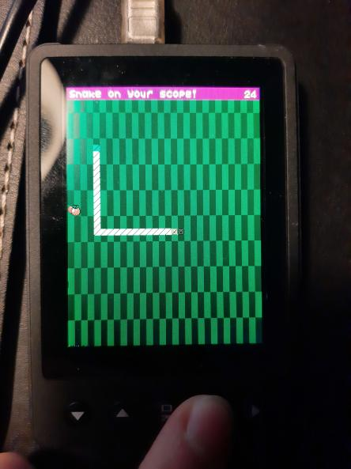

# Snake on the DSO Nano V3 oscilloscope

## Intro
The [DSO Nano V3](https://www.seeedstudio.com/DSO-Nano-v3.html) is a cheap open-source (both hardware and software) oscilloscope by [Seeed Studios](https://www.seeedstudio.com/) that runs on a STM32F1.

Using an STLink device, it can be freely reprogrammed. I made a Snake game that runs on it in C using the STM32CubeIDE.

I had to write a little screen driver for the screen it embeds. This project is my first true embedded project.

## Pictures

